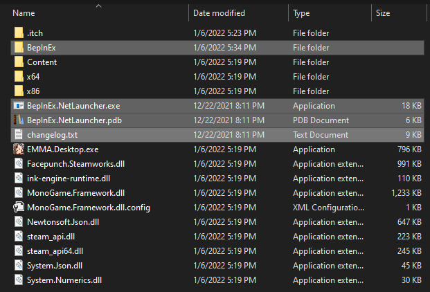

<h1>BmmLLaunchPatch</h1>

This is a patch that allows you to play the itch.io version of "Bury Me, My Love," which can be bought <a href="https://dear-villagers.itch.io/bury-me-my-love">here</a>. You can download this patch, and everything else you need, from the "Releases" section on GitHub: <a href="https://github.com/usrbincat/BmmLLaunchPatch/releases">https://github.com/usrbincat/BmmLLaunchPatch/releases</a>
 
 
<h2>How do I use this?</h2>
<ol>
<li>Download the patch (<code>BmmLLaunchPatch.zip</code>) from the link above.</li>
<li>Extract the .zip file into the same folder as your game. If you use the itch.io launcher on windows, this folder is probably located at <code>%APPDATA%\itch\apps\bury-me-my-love</code>. 
Once you do this, your game folder should look like this:

</li>
<li>Run <code>BepInEx.NetLauncher.exe</code> to patch and run the game.</li>
</ol>
 
<h2>Important Things to Know</h2>
<ul>
<li>The game launches in French, but you can change it: After the intro sequence, you can change the language to English or something else by clicking on the "Settings" icon in the upper right corner of the in-game phone.</li>
<li>The game forces you to restart from the beginning when you reach an "end," no matter if it's good or bad. It can take a while to replay the game up until the place where you made the "wrong turn." I manually took snapshots of the game's <code>%APPDATA%\BmmL</code> folder about every hour or so, so I wouldn't have to restart from the beginning if I got a bad end. If you're technically savvy enough to do this, I highly recommend it.

(At least this version of the game doesn't make you <a href="https://www.gdcvault.com/play/1024942/Exploring-Helplessness-in-Games-with">wait real time between every interaction</a>.)</li>
</ul>
 
<h2>Technical Info</h2>
The reason the game crashes is that it tries to connect to Steam when it launches, so it can register achievements or something. Since this is the itch version, that fails, and the game doesn't run as a result. This patch removes the code does that, and the rest of the game works fine without it.
 
 
<h2>Build Instructions</h2>
To build this project yourself, you'll .NET Core and BepInEx_NetLauncher_249a185_6.0.0-be.530.zip from <a href="https://builds.bepis.io/projects/bepinex_be">https://builds.bepis.io/projects/bepinex_be</a> (later versions of NetLauncher will probably work as well). Open the project in your terminal of choice and run <code>dotnet build</code>. Copy NetLauncher and associated folders into the game directory, and copy <code>BMMLLaunchPatch.dll</code> into the <code>BepInEx\patchers</code> folder, which you will need to create. Run NetLauncher once, which will show this error and exit right away:

<pre>
[Fatal  : Preloader] Entry executable was not set. Please set this in your config before launching the application
Press enter to exit...
</pre>
NetLauncher helpfully creates the config file for you. Edit the <code>BepInEx\config\BepInEx.cfg</code> file to point to the correct executable:

<pre>
[Preloader.Entrypoint]
## The local filename of the .NET executable to target.
# Setting type: String
# Default value: 
Assembly = EMMA.Desktop.exe
</pre>
Run NetLauncher again, and this time the game should start.
 
 
 

<b>Many thanks to the helpful members of the BepInEx Discord server 🐎</b>
